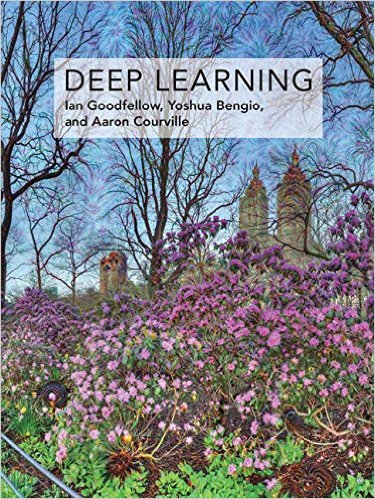
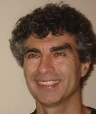

## Deep Learning - notes

Studying Deep learning.

Excellent book:
### "Deep Learning" - by Ian Goodfellow, Yoshua Bengio, Aaron Courville
(MIT Press, December 2016)
  ~$70 on amazon.
  free on this web site: - http://www.deeplearningbook.org
  You can also google for PDF version.
 
<table width="77%" border="0" cellpadding="2" cellspacing="2">
  <tr>
    <td width="21%" valign="top"></td>
    <td width="22%" valign="top"> 
    <b>Ian J. Goodfellow</b> is a computer scientist working in machine learning, currently employed as a research scientist at OpenAI. 
    San Francisco.
Student of Yoshua Bengio.</td>
    <td width="21%" valign="top"> 
    <b>Yoshua Bengio</b> - Full Professor, head of the Montreal Institute for Learning Algorithms. Most noted for his work on artificial neural networks and deep learning.</td>
    <td width="21%" valign="top"> 
    <b>Aaron Courville</b> - Assistant Professor in the Department of Computer Science and Operations Research at the University of Montreal, Canada</td>
  </tr>
</table>

================

The Great A.I. Awakening - by Gideon Lewis-Kraus, Dec. 14, 2016
 - https://www.nytimes.com/2016/12/14/magazine/the-great-ai-awakening.html

================

Google Translate research paper (Sep 2016):
 - https://arxiv.org/pdf/1609.08144v2.pdf

Also:
 - https://research.googleblog.com/2016/09/a-neural-network-for-machine.html
 - https://www.youtube.com/watch?v=g4BY142rBNc

================

Yann LeCun (NYU, FB):
RI Seminar: Yann LeCun : The Next Frontier in AI: Unsupervised Learning
 - https://www.youtube.com/watch?v=IbjF5VjniVE

================

Stanford - 15 lectures ( CS231n )
Fei-Fei Li & Andrej Karpathy & Justin Johnson
 - https://www.youtube.com/channel/UC2__PIf36huAgKFumlOIs6A

================

Oxford - Deep Learning lectures -  Nando de Freitas
 - https://www.youtube.com/user/ProfNandoDF/videos

================

Hinton lectures (Neural Networks for Machine Learning)
 - https://www.youtube.com/user/colinmcd94/videos

================

IanGoodfellow PhD Defense Presentation 
 - https://www.youtube.com/watch?v=ckoD_bE8Bhs

Ian Goodfellow Do statistical models understand the world? 
 - https://www.youtube.com/watch?v=hDlHpBBGaKs

================
MIT AI course, Patrick H. Winston :

2015:
 - https://www.youtube.com/watch?v=uXt8qF2Zzfo
 - https://www.youtube.com/watch?v=VrMHA3yX_QI

2010:
 - https://ocw.mit.edu/courses/electrical-engineering-and-computer-science/6-034-artificial-intelligence-fall-2010/lecture-videos/

================
================
================

### videos about Deep Learning and programming ML & DL

================

Yann LeCun (NYU, Director of AI Research, Facebook):
 - [keynote talk at NIPS 2016](https://channel9.msdn.com/Events/Neural-Information-Processing-Systems-Conference/Neural-Information-Processing-Systems-Conference-NIPS-2016/Predictive-Learning)
 - [RI Seminar: Yann LeCun : The Next Frontier in AI: Unsupervised Learning](https://www.youtube.com/watch?v=IbjF5VjniVE)
 - [Udacity Talks](https://www.youtube.com/watch?v=Gwad1cWMcC0)
 - [Deep Learning and the Future of AI](https://www.youtube.com/watch?v=_1Cyyt-4-n8)
 - [Deep Learning and the Future of AI Q&A](https://www.youtube.com/watch?v=w2IJD4FzYRM)

================

Stanford - 15 lectures ( CS231n )
Fei-Fei Li & Andrej Karpathy & Justin Johnson
 - https://www.youtube.com/channel/UC2__PIf36huAgKFumlOIs6A

================

Oxford - Deep Learning lectures -  Nando de Freitas
 - https://www.youtube.com/user/ProfNandoDF/videos

================

Hinton lectures (Neural Networks for Machine Learning)
 - https://www.youtube.com/user/colinmcd94/videos

================

IanGoodfellow PhD Defense Presentation 
 - https://www.youtube.com/watch?v=ckoD_bE8Bhs

Ian Goodfellow Do statistical models understand the world? 
 - https://www.youtube.com/watch?v=hDlHpBBGaKs

GANs - short 5min video by Siraj Raval:
 - https://www.youtube.com/watch?v=deyOX6Mt_As

NIPs tutorial on GANs by Ian Goodfellow
 - https://arxiv.org/pdf/1701.00160v3.pdf
 - https://www.youtube.com/watch?v=HN9NRhm9waY

Also Alec Radford:
 - https://www.youtube.com/watch?v=KeJINHjyzOU

================

Dr. Jack Szostak (2009 Nobel Prize):

How Evolution REALLY Works, Part I:
  - https://www.youtube.com/watch?v=SeTssvexa9s

The Joy of Sex (ual Reproduction)
  - https://www.youtube.com/watch?v=fL_nuacgpo8

================

MIT AI course, Patrick H. Winston :

2015:
 - https://www.youtube.com/watch?v=uXt8qF2Zzfo
 - https://www.youtube.com/watch?v=VrMHA3yX_QI

2010:
 - https://ocw.mit.edu/courses/electrical-engineering-and-computer-science/6-034-artificial-intelligence-fall-2010/lecture-videos/

================

Neural Networks and Deep Learning - free online book
 - http://neuralnetworksanddeeplearning.com/index.html

================

NIPS - Neural Information Processing Systems (Annual Conference)
 - https://nips.cc

================

D-Wave Founder Eric Ladizinsky - The Coming Quantum Computing Revolution 
 - https://www.youtube.com/watch?v=PUlYV--lLAA

================

Davos 2017 - Sergey Brin: The Future of AI and Google 
 - https://www.youtube.com/watch?v=XzkUAxtEQXE 

================

Deep Learning Frameworks Compared
 - https://www.youtube.com/watch?v=MDP9FfsNx60 -

================

Backpropagation Neural Network - How it Works e.g. Counting
 - https://www.youtube.com/watch?v=WZDMNM36PsM -

================

Python & Machine Learning
 - https://www.youtube.com/watch?v=OGxgnH8y2NM&list=PLQVvvaa0QuDfKTOs3Keq_kaG2P55YRn5v - 

================

TwoMinutePapers by Károly Zsolnai-Fehér .
He is from the Institute of Computer Graphics and Algorithms,
Vienna University of Technology, Austria.
Károly  has created a lot of short 2-3 min videos,
which are really good and short

Here is his talk about creating an interesting talk:
 - https://www.youtube.com/watch?v=ZhqgfIytHDs - 

Also see:
 - https://users.cg.tuwien.ac.at/zsolnai/tag/personal/ -
 - Patreon - https://www.patreon.com/TwoMinutePapers
 - Facebook - https://www.facebook.com/TwoMinutePapers
 - Twitter - https://twitter.com/karoly_zsolnai
 - Web - https://cg.tuwien.ac.at/~zsolnai/

Artificial Neural Networks and Deep Learning
 - https://www.youtube.com/watch?v=rCWTOOgVXyE - 

How To Get Started With Machine Learning?
 - https://www.youtube.com/watch?v=4h0uC9FPVMQ - 

Google DeepMind's Deep Q-learning playing Atari Breakout
 - https://www.youtube.com/watch?v=V1eYniJ0Rnk -

Deep Neural Network Learns Van Gogh's Art
 - https://www.youtube.com/watch?v=-R9bJGNHltQ - 

Recurrent Neural Network Writes Music and Shakespeare Novels
 - https://www.youtube.com/watch?v=Jkkjy7dVdaY - 

 Recurrent Neural Network Writes Sentences About Images
  - https://www.youtube.com/watch?v=e-WB4lfg30M - 

How Does Deep Learning Work?
 - https://www.youtube.com/watch?v=He4t7Zekob0 - 

Terrain Traversal with Reinforcement Learning
 - https://www.youtube.com/watch?v=_yjHPu1aYCY - 

Google DeepMind's Deep Q-Learning & Superhuman Atari Gameplays
 - https://www.youtube.com/watch?v=Ih8EfvOzBOY - 

OpenAI - Non-profit AI company by Elon Musk and Sam Altman (Dec 2015)
 - https://www.youtube.com/watch?v=AbcRlDBnwjM - 

How Do Genetic Algorithms Work?
 - https://www.youtube.com/watch?v=ziMHaGQJuSI -

Neural Programmer-Interpreters Learn To Write Programs
 - https://www.youtube.com/watch?v=B70tT4WMyJk - 

9 Cool Deep Learning Applications
 - https://www.youtube.com/watch?v=Bui3DWs02h4 -

10 More Cool Deep Learning Applications
 - https://www.youtube.com/watch?v=hPKJBXkyTKM - 

10 Even Cooler Deep Learning Applications
 - https://www.youtube.com/watch?v=aKSILzbAqJs - 

How DeepMind Conquered Go With Deep Learning (AlphaGo)
 - https://www.youtube.com/watch?v=IFmj5M5Q5jg -

Breaking Deep Learning Systems With Adversarial Examples
 - https://www.youtube.com/watch?v=j9FLOinaG94 -

Deep Learning Program Learns to Paint
 - https://www.youtube.com/watch?v=UGAzi1QBVEg -

Decision Trees and Boosting, XGBoost
 - https://www.youtube.com/watch?v=0Xc9LIb_HTw -

Overfitting and Regularization For Deep Learning
 - https://www.youtube.com/watch?v=6aF9sJrzxaM - 

Training Deep Neural Networks With Dropout
 - https://www.youtube.com/watch?v=LhhEv1dMpKE -

Deep Learning and Cancer Research
 - https://www.youtube.com/watch?v=5PSWr2ovBvU - 

Reinforcement Learning with OpenAI's Gym
 - https://www.youtube.com/watch?v=1PNhuHa7lS0 - 

Hallucinating Images With Deep Learning
 - https://www.youtube.com/watch?v=hnT-P3aALVE -

Visually Indicated Sounds
 - https://www.youtube.com/watch?v=flOevlA9RyQ -
 
What is Optimization? + Learning Gradient Descent
 - https://www.youtube.com/watch?v=1ypV5ZiIbdA -
 
What is an Autoencoder? 
 - https://www.youtube.com/watch?v=Rdpbnd0pCiI - 
 
How Do Neural Networks See The World? 
 - https://www.youtube.com/watch?v=hBobYd8nNtQ - 
 
